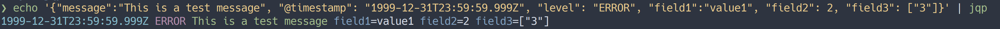

# jqp

[](https://github.com/georgijd/jqp/actions/workflows/ci.yaml)

Prettify JSON lines



## Usage

Pipe the JSON into `jqp`

```bash
$ echo '{"field1":"value1", "field2": 2, "field3": ["3"]}' | jqp
field1=value1 field2=2 field3=["3"]
```

Example JSON log message with `@timestamp`, `level` and `message` fields

```bash
$ echo '{"message":"This is a test message", "@timestamp": "1999-12-31T23:59:59.999Z", "level": "ERROR", "field1":"value1", "field2": 2, "field3": ["3"]}' | jqp
1999-12-31T23:59:59.999Z ERROR This is a test message field1=value1 field2=2 field3=["3"]
```

You can use it to format K8S JSON logs:

```bash
kubectl logs -f <POD> | jqp
```

## Installation

```bash
curl -s "https://raw.githubusercontent.com/georgijd/jqp/main/scripts/install.sh" | bash
```

## Configuration

You can optionally create a configuration file and set colours and priorities
for all JSON fields.
The configuration file must be located under `$XDG_CONFIG_HOME/jqp/config.json`.
See the `sample.config.json` as example. It contains the default values which
will be used if no configuration file is found.

The configuration file allows you to set the priority and the colour of the
value for each field.

Setting a field's priority will:

1. Print only the field value
2. Change the position of the field according to the value

Setting a field's colour will:

1. Change the colour of the field value

You can also change the colour of the field key with the `fieldKeyColour` option.

Only the main 16 terminal colours are supported:

| Colour       | Description |
|--------------|-------------|
| black        | Colour000   |
| red          | Colour001   |
| green        | Colour002   |
| yellow       | Colour003   |
| blue         | Colour004   |
| magenta      | Colour005   |
| cyan         | Colour006   |
| lightgray    | Colour007   |
| darkgray     | Colour008   |
| lightred     | Colour009   |
| lightgreen   | Colour010   |
| lightyellow  | Colour011   |
| lightblue    | Colour012   |
| lightmagenta | Colour013   |
| lightcyan    | Colour014   |
| white        | Colour015   |

## Uninstallation

```bash
curl -s "https://raw.githubusercontent.com/georgijd/jqp/main/scripts/uninstall.sh" | bash
```
